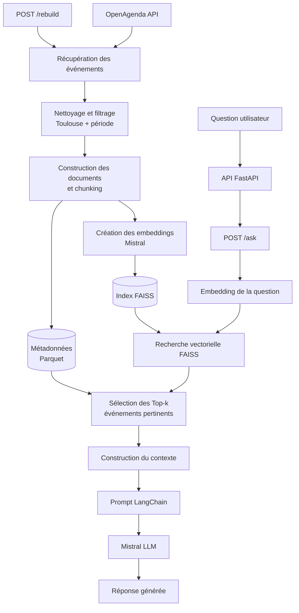

Sur macOS Apple Silicon, installer FAISS via conda-forge :

conda install -c conda-forge faiss-cpu


# Puls-Events – Système RAG de recommandation d'événements

## 1. Contexte et objectifs

Ce projet a été réalisé dans le cadre du parcours **Data Scientist d'OpenClassrooms**.

L'objectif est de développer un **Proof of Concept (POC) d'un système RAG (Retrieval-Augmented Generation)** pour Puls-Events, capable de recommander des événements et des activités à Toulouse à partir de questions formulées en langage naturel.

Le système s'appuie sur les données issues d'**OpenAgenda** et combine plusieurs briques techniques :

- récupération et préparation des données d'événements ;
- génération d'embeddings avec **Mistral AI** ;
- indexation et recherche vectorielle avec **FAISS** ;
- génération de réponses avec un **LLM Mistral** ;
- orchestration du pipeline avec **LangChain** ;
- exposition du système via une API REST développée avec **FastAPI** ;
- conteneurisation de l'application avec **Docker**.

### Objectifs du projet

L'objectif principal est de générer des réponses pertinentes à partir des événements présents dans la base de connaissances, tout en limitant les informations non supportées par les données sources.

Le projet vise également à évaluer :

- la qualité de la récupération des événements ;
- la fidélité des réponses générées au contexte récupéré ;
- la capacité du système à traiter différents cas d'usage ;
- la robustesse de l'API ;
- la reproductibilité de la solution grâce aux tests automatisés et à Docker.

## 2. Architecture du projet

### 2.1 Architecture fonctionnelle

L'architecture repose sur deux étapes principales :

- **Construction de la base vectorielle** : les événements sont récupérés depuis OpenAgenda, nettoyés et transformés en documents. Les embeddings sont générés avec Mistral puis indexés dans FAISS avec leurs métadonnées.
- **Interrogation du RAG** : la question de l'utilisateur est vectorisée puis comparée aux événements indexés. Les événements les plus pertinents sont utilisés comme contexte par le LLM Mistral afin de générer une réponse.

L'API FastAPI permet d'interroger le système via `/ask` et de reconstruire la base vectorielle via `/rebuild`.



### 2.2 Structure du dépôt

```text
.
├── api/                            # API REST FastAPI
│   └── api.py
│
├── data/
│   ├── processed/
│   │   └── events_clean.parquet    # Données OpenAgenda nettoyées
│   └── vector_store/
│       ├── event_documents.parquet # Documents et métadonnées associés aux vecteurs
│       ├── event_embeddings.npy    # Embeddings des événements
│       └── events.faiss            # Index vectoriel FAISS
│
├── evaluation/                     # Évaluation des performances du RAG
│   ├── analyse_evaluation.ipynb    # Analyse et visualisation des résultats
│   ├── evaluate_annotated.py       # Évaluation sur le jeu de données annoté
│   ├── evaluate_rag.py             # Évaluation automatique avec Ragas
│   ├── test_cases.json             # Cas de test annotés
│   └── results/
│       ├── annotated_results.csv   # Résultats de l'évaluation humaine
│       └── ragas_results.csv       # Scores Ragas
│
├── notebooks/                      # Exploration et analyse des données
│
├── src/
│   ├── data/                       
│   │   ├── clean_events.py         # Nettoyage et préparation des événements
│   │   └── openagenda_import.py    # Récupération des données OpenAgenda
│   └── rag/                        
│       ├── create_embeddings.py    # Création des embeddings Mistral
│       ├── faiss_index.py          # Construction de l'index FAISS
│       ├── rag_chain.py            # Recherche et génération des réponses
│       └── rebuild_vector_store.py # Reconstruction de la base vectorielle
│
├── tests/                          # Tests unitaires et fonctionnels
│   ├── test_answer_question.py
│   ├── test_api.py
│   ├── test_clean_events.py
│   ├── test_create_embeddings.py
│   ├── test_environment.py
│   ├── test_faiss_index.py
│   ├── test_rag_utils.py
│   └── test_retrieval.py
│
├── .dockerignore                   # Fichiers exclus de l'image Docker
├── .gitignore                      # Fichiers exclus de Git
├── Dockerfile                      # Construction de l'image Docker
├── requirements.txt                # Dépendances du projet
├── requirements-runtime.txt        # Dépendances nécessaires à l'exécution
└── README.md                       # Documentation du projet
```

## 3. Données et préparation

### 3.1 Source des données

Les données utilisées proviennent de l'API **OpenAgenda**, qui fournit des informations structurées sur des événements publiés dans différents agendas.

Dans le cadre de ce POC, les données sont récupérées pour **Toulouse**. Une contrainte temporelle est également appliquée : les événements conservés ont une **ancienneté maximale d'un an**, tout en permettant la récupération des événements futurs.

Les événements contiennent notamment des informations sur :

- le titre et la description ;
- les dates et horaires ;
- le lieu et l'adresse ;
- les conditions de participation ;
- le public concerné ;
- l'accessibilité ;
- les mots-clés et autres informations descriptives.

La récupération des données est réalisée par le script `src/data/openagenda_import.py`.

### 3.2 Récupération des événements

La récupération des données depuis OpenAgenda est réalisée en deux étapes.

Dans un premier temps, les **agendas correspondant à Toulouse** sont recherchés via l'API OpenAgenda. Cette étape permet de limiter la collecte au périmètre géographique du projet et d'alléger l'import.

Dans un second temps, les **événements associés à ces agendas** sont récupérés. L'API étant paginée, les événements sont collectés par lots jusqu'à récupération de l'ensemble des résultats disponibles.

Une contrainte temporelle est également appliquée afin de limiter la base aux événements pertinents pour le POC : les événements peuvent avoir une **ancienneté maximale d'un an**, tandis que les événements futurs sont également conservés.

La récupération suit donc le processus suivant :

**OpenAgenda → agendas liés à Toulouse → événements de ces agendas → sélection temporelle**

Cette étape est automatisée dans le script `src/data/openagenda_import.py`.

### 3.3 Nettoyage et préparation des données

Les événements récupérés depuis OpenAgenda sont ensuite nettoyés et standardisés afin d'obtenir des données cohérentes et directement exploitables par le système RAG.

Les principales transformations sont :

- **sélection des colonnes utiles** au projet parmi les données brutes OpenAgenda ;
- **normalisation des valeurs manquantes** et des champs vides ;
- **fusion des événements dupliqués par `uid`** : la version la plus récente est privilégiée et complétée avec les informations présentes dans les autres occurrences ;
- **nettoyage des champs textuels** et suppression des balises HTML ;
- **standardisation des informations structurées** : dates et créneaux, âge, accessibilité, statut, mode de participation et modalités d'inscription ;
- **extraction des informations de localisation** (nom, adresse, ville, département, région, coordonnées) et uniformisation des valeurs géographiques ;
- **suppression des colonnes vides ou constantes** qui n'apportent pas d'information utile.

Les opérations de nettoyage sont principalement implémentées dans `src/data/clean_events.py`. Le jeu de données obtenu est sauvegardé au format **Parquet** dans `data/processed/events_clean.parquet` et constitue l'entrée du pipeline de construction de la base vectorielle.

## 4. Construction du système RAG

Le système repose sur une architecture **RAG (Retrieval-Augmented Generation)** qui combine une recherche vectorielle dans les événements OpenAgenda avec la génération de réponses par un modèle de langage.

À partir des données nettoyées, le pipeline suit les étapes suivantes :

**Données nettoyées → Documents → Embeddings Mistral → Index FAISS → Recherche des événements pertinents → Construction du contexte → LLM Mistral → Réponse**

### 4.1 Construction des documents

Les événements nettoyés sont transformés en documents textuels afin de pouvoir être représentés sous forme de vecteurs.

Pour chaque événement nettoyé, un texte sémantique est construit à partir des champs suivants :

- titre ;
- description courte et détaillée ;
- mots-clés ;
- date et horaires ;
- lieu et adresse ;
- tranche d'âge ;
- accessibilité ;
- conditions de participation ;
- mode de participation ;
- statut de l'événement.

Seules les informations disponibles sont ajoutées au texte, sous la forme `Libellé : valeur`, afin de produire une représentation claire et homogène de chaque événement.

Ce texte est ensuite découpé en **chunks de 1 000 caractères avec un chevauchement de 150 caractères**. Chaque chunk conserve l'`uid` de l'événement, son titre, un identifiant de chunk ainsi que les principales métadonnées utiles pour la recherche et la génération de réponse. 

La construction des documents est réalisée dans `src/rag/create_embeddings.py`.

### 4.2 Création des embeddings

La génération des embeddings est également réalisée dans `src/rag/create_embeddings.py`.

Chaque chunk est vectorisé à l'aide du modèle **`mistral-embed`** de Mistral AI. Les textes sont envoyés à l'API par lots de **32** afin de limiter le nombre d'appels et de traiter efficacement l'ensemble des documents.

Les vecteurs obtenus sont convertis au format `float32`, adapté à leur utilisation avec FAISS.

À l'issue de cette étape, deux fichiers intermédiaires sont générés dans `data/vector_store/` :

- `event_embeddings.npy` : matrice NumPy contenant les vecteurs générés pour chaque chunk ;
- `event_documents.parquet` : documents et métadonnées conservés dans le même ordre que les vecteurs.

Le fichier `event_embeddings.npy` est utilisé comme **fichier intermédiaire pour la construction de l'index FAISS**. Il peut être entièrement régénéré à partir des données nettoyées et n'est donc pas versionné dans le dépôt Git.


### 4.3 Indexation avec FAISS

La construction de l'index vectoriel est réalisée dans `src/rag/faiss_index.py`.

Les embeddings précédemment générés dans `event_embeddings.npy` sont chargés puis utilisés pour construire un index **FAISS**. Les vecteurs sont normalisés afin de permettre une recherche par similarité cosinus via un index `IndexFlatIP`.

L'index obtenu est sauvegardé dans : `data/vector_store/events.faiss`

Les documents et leurs métadonnées restent stockés séparément dans le fichier deja existant : `data/vector_store/event_documents.parquet`

L'ordre des lignes dans le fichier Parquet correspond à l'ordre des vecteurs dans l'index FAISS. Lorsqu'une recherche retourne l'identifiant d'un vecteur, le système peut ainsi retrouver le chunk et les informations de l'événement correspondant.

Le fichier `event_embeddings.npy` sert uniquement d'intermédiaire pour construire l'index. Une fois `events.faiss` créé, le système RAG utilise directement l'index FAISS et `event_documents.parquet` pour effectuer les recherches.

### 4.4 Recherche des événements

La recherche des événements pertinents est implémentée dans `src/rag/rag_chain.py`.

Lorsqu'une question est envoyée au système, elle est d'abord transformée en vecteur avec le même modèle **`mistral-embed`** que celui utilisé pour les événements. Le vecteur de la question est ensuite normalisé afin d'être compatible avec la recherche par similarité réalisée dans FAISS.

L'index `events.faiss` est interrogé pour identifier les chunks sémantiquement les plus proches de la question. Les indices retournés permettent de récupérer les documents et métadonnées correspondants dans `event_documents.parquet`.

Les résultats sont ensuite :

- classés selon leur score de similarité ;
- **dédupliqués par `uid`** afin d'éviter de proposer plusieurs chunks provenant du même événement ;
- limités aux **Top-k événements** les plus pertinents, avec une valeur par défaut de `k = 5`.

À l'issue de cette étape, le système dispose des événements et de leurs métadonnées correspondant le mieux à la question de l'utilisateur.

### 4.5 Génération des réponses

La génération des réponses est également gérée dans `src/rag/rag_chain.py`.

À partir des événements récupérés lors de l'étape de recherche, le système construit un contexte textuel regroupant les informations des événements sélectionnés. Ce contexte et la question de l'utilisateur sont ensuite intégrés dans un **`ChatPromptTemplate` LangChain**.

Le prompt encadre le comportement du modèle afin d'obtenir des réponses pertinentes et fondées sur les données récupérées. Il lui impose notamment de :

- répondre uniquement à partir des événements présents dans le contexte ;
- ne jamais inventer d'événement ou d'information absente (date, lieu, tarif, condition, etc.) ;
- sélectionner uniquement les événements correspondant réellement aux critères de la question, sans obligation de tous les restituer ;
- privilégier les recommandations les plus pertinentes et expliquer brièvement leur adéquation avec la demande ;
- utiliser les informations complémentaires (public, accessibilité, inscription, conditions...) uniquement lorsqu'elles sont utiles ;
- indiquer clairement lorsqu'aucun événement du contexte ne répond à la demande ;
- produire une réponse concise, naturelle, sans répétitions et en français.

La réponse est générée avec le modèle **`mistral-small-latest`** de Mistral AI, avec une température de **0,2** afin de privilégier des réponses stables et factuelles.

Le système retourne finalement :

- la question utilisateur ;
- la réponse générée ;
- les événements sélectionnés ;
- les contextes récupérés utilisés pour la génération.

## 5. API FastAPI

### 5.1 Présentation de l'API

Le système RAG est exposé sous la forme d'une **API REST développée avec FastAPI**, implémentée dans `api/api.py`.

Au démarrage de l'application, l'index FAISS et les métadonnées associées sont chargés en mémoire afin d'être directement disponibles lors des requêtes. Cela évite de recharger la base vectorielle à chaque appel au système RAG.

L'API permet principalement :

- d'interroger le système RAG à partir d'une question utilisateur ;
- de consulter l'état et les métadonnées de la base vectorielle ;
- de reconstruire la base vectorielle à partir des données OpenAgenda.

### 5.2 Endpoints disponibles

L'API expose plusieurs endpoints permettant d'interagir avec le système et de contrôler son état.

| Méthode | Endpoint | Description |
|---|---|---|
| `GET` | `/health` | Vérifie que l'API fonctionne et que la base vectorielle est chargée. |
| `GET` | `/metadata` | Retourne des informations sur la base vectorielle actuellement chargée. |
| `POST` | `/ask` | Envoie une question au système RAG et retourne une réponse générée à partir des événements récupérés. |
| `POST` | `/rebuild` | Relance le pipeline de récupération des données, de création des embeddings et de reconstruction de l'index FAISS. |

#### `POST /ask`

L'endpoint principal de l'API reçoit une question en langage naturel ainsi qu'un paramètre `k` optionnel correspondant au nombre maximal d'événements à récupérer. Par défaut, `k = 5`.

La requête déclenche le processus de recherche et de génération décrit précédemment : vectorisation de la question, recherche dans FAISS, récupération des événements pertinents puis génération de la réponse avec Mistral.

#### `POST /rebuild`

L'endpoint `/rebuild` permet de reconstruire la base vectorielle lorsque les données OpenAgenda doivent être actualisées.

Il relance successivement :

**Récupération OpenAgenda → Nettoyage → Construction des documents → Embeddings Mistral → Indexation FAISS**

Une fois la reconstruction terminée, la nouvelle base vectorielle est rechargée en mémoire afin que les requêtes suivantes utilisent immédiatement les nouvelles données.

### 5.3 Documentation Swagger et exemples d'utilisation

FastAPI génère automatiquement une documentation interactive **Swagger UI**, accessible lorsque l'API est en cours d'exécution à l'adresse :

`http://localhost:8000/docs`

Cette interface permet de consulter les paramètres attendus par chaque endpoint, les schémas de réponse et de tester directement les requêtes.

#### Vérifier l'état de l'API

```bash
curl http://localhost:8000/health
```

#### Consulter les métadonnées

```bash
curl http://localhost:8000/metadata
```

#### Interroger le système RAG

```bash
curl -X POST "http://localhost:8000/ask" \
  -H "Content-Type: application/json" \
  -d '{
    "question": "Quels concerts de jazz sont prévus en 2026 ?",
    "k": 5
  }'
```

Le paramètre `question` contient la requête formulée en langage naturel et `k` détermine le nombre maximal d'événements récupérés lors de la recherche vectorielle.

#### Reconstruire la base vectorielle

```bash
curl -X POST "http://localhost:8000/rebuild"
```

Cette requête relance l'ensemble du pipeline de données et reconstruit l'index FAISS avant de recharger la nouvelle base vectorielle dans l'API.

## 6. Installation et utilisation

### 6.1 Prérequis et environnement

Le projet a été développé avec **Python 3.11** dans un environnement Conda.

Création et activation de l'environnement :

```bash
conda create -n oc-p9 python=3.11
conda activate oc-p9
```

### 6.2 Installation des dépendances

Les dépendances nécessaires au développement sont définies dans `requirements.txt` :

```bash
pip install -r requirements.txt
```

#### Cas particulier : FAISS sur macOS Apple Silicon

Sur macOS avec une puce Apple Silicon, l'installation de `faiss-cpu` via `pip` peut entraîner des problèmes liés aux bibliothèques OpenMP.

Dans cet environnement, FAISS a été installé via **conda-forge** :

```bash
conda install -c conda-forge faiss-cpu
```

Cette installation remplace celle de `faiss-cpu` présente dans `requirements.txt` si nécessaire.

#### Cas particulier : Ragas 0.4.3

L'évaluation automatique utilise **Ragas 0.4.3**. Dans l'environnement utilisé pour ce projet, cette version présente une incompatibilité d'import avec les versions récentes de LangChain.

Un correctif local a été nécessaire dans `ragas/llms/base.py` en remplaçant l'import de `ChatVertexAI` par :

```python
from langchain_google_vertexai import ChatVertexAI
```

Cette particularité concerne uniquement l'exécution de l'évaluation Ragas et n'est pas nécessaire au fonctionnement de l'API RAG.

### 6.3 Configuration des variables d'environnement

Le projet utilise des clés API pour accéder aux services **Mistral AI** et **OpenAgenda**.

Un fichier `.env` doit être créé à la racine du projet :

```env
MISTRAL_KEY=votre_cle_mistral
OPENAGENDA_KEY=votre_cle_openagenda
```

Les variables sont chargées dans l'application avec `python-dotenv`.

Le fichier `.env` contient des informations sensibles et est donc exclu du versionnement via `.gitignore`. Les clés API ne sont ainsi jamais stockées dans le dépôt Git.

Avant de lancer l'application ou de reconstruire la base vectorielle, il est nécessaire de vérifier que les deux clés sont correctement renseignées.

### 6.4 Lancement local de l'API

Une fois l'environnement activé, les dépendances installées et les variables d'environnement configurées, l'API peut être lancée depuis la racine du projet avec **Uvicorn** :

```bash
uvicorn api.api:app --reload
```

L'API est alors accessible localement à l'adresse :

`http://localhost:8000`

Pour vérifier son bon fonctionnement, l'endpoint de santé peut être appelé :

```bash
curl http://localhost:8000/health
```

La documentation interactive Swagger est disponible à l'adresse :

`http://localhost:8000/docs`

Elle permet de consulter et de tester directement les différents endpoints de l'API.

## 7. Conteneurisation avec Docker

L'application peut également être exécutée dans un conteneur Docker afin de garantir un environnement reproductible, indépendant de la configuration locale.

Le projet utilise :

- un `Dockerfile` pour construire l'image de l'application ;
- un fichier `requirements-runtime.txt` contenant uniquement les dépendances nécessaires à l'exécution de l'API.

Les dépendances de développement, de test et d'évaluation comme `pytest`, `pytest-cov` ou `ragas` ne sont donc pas installées dans l'image Docker.

### 7.1 Construction de l'image

Depuis la racine du projet, l'image peut être construite avec :

```bash
docker build -t p9-puls-events-rag .
```

### 7.2 Lancement du conteneur

Le conteneur peut être lancé avec :

```bash
docker run --rm \
  -p 8000:8000 \
  --env-file .env \
  p9-puls-events-rag
```

Le port `8000` du conteneur est exposé sur le port `8000` de la machine locale.

L'API devient alors accessible sur :

`http://localhost:8000`

et la documentation Swagger sur :

`http://localhost:8000/docs`

### 7.3 Persistance de la base vectorielle

L'endpoint `/rebuild` reconstruit les fichiers de la base vectorielle à l'intérieur du conteneur.

Afin de conserver ces fichiers après l'arrêt du conteneur, le dossier local `data/vector_store` peut être monté comme volume Docker :

```bash
docker run --rm \
  -p 8000:8000 \
  --env-file .env \
  -v "$(pwd)/data/vector_store:/app/data/vector_store" \
  p9-puls-events-rag
```

Grâce à ce volume, les fichiers générés ou remplacés lors d'un appel à `/rebuild`, notamment `events.faiss` et `event_documents.parquet`, sont directement sauvegardés dans le projet local.

La nouvelle base vectorielle est ensuite rechargée par l'API et utilisée pour les requêtes suivantes.

## 8. Tests et intégration continue

### 8.1 Tests automatisés

Le projet dispose d'une suite de tests automatisés développée avec **pytest** afin de vérifier les principales étapes du pipeline et le fonctionnement de l'API.

Les tests couvrent notamment :

- le nettoyage et la préparation des données OpenAgenda ;
- la construction des textes et des embeddings ;
- la création et l'interrogation de l'index FAISS ;
- les fonctions de recherche et de récupération des événements ;
- la génération des réponses par le système RAG ;
- le fonctionnement des endpoints de l'API FastAPI ;
- la validation de l'environnement du projet.

Les tests sont regroupés dans le dossier `tests/` et peuvent être exécutés depuis la racine du projet avec :

```bash
python -m pytest -v
```

### 8.2 Couverture des tests

La couverture du code est mesurée avec **pytest-cov** afin de vérifier la proportion du code exécutée par les tests automatisés.

Elle peut être calculée avec :

```bash
python -m pytest --cov=api --cov=src --cov-report=term-missing
```

Lors de la dernière exécution de la pipeline de tests, les résultats obtenus sont :

| Module | Couverture |
|---|---:|
| `api/api.py` | 72 % |
| `src/data/clean_events.py` | 70 % |
| `src/rag/create_embeddings.py` | 78 % |
| `src/rag/faiss_index.py` | 94 % |
| `src/rag/rag_chain.py` | 66 % |
| `src/rag/rebuild_vector_store.py` | 33 % |
| **Couverture globale** | **72 %** |

Au total, **37 tests sont exécutés avec succès**.

La couverture globale atteint **72 %**, ce qui permet de vérifier une grande partie des fonctionnalités principales du projet.

Les tests se concentrent notamment sur le traitement des données, la recherche FAISS, le fonctionnement du RAG et les endpoints de l'API.

### 8.3 Intégration continue avec GitHub Actions

Une pipeline d'intégration continue est configurée avec **GitHub Actions** afin de vérifier automatiquement le projet lors des mises à jour du dépôt.

À chaque push, GitHub Actions :

- installe l'environnement Python et les dépendances du projet ;
- exécute les tests automatisés avec `pytest` ;
- calcule la couverture du code ;
- vérifie que la couverture globale reste supérieure ou égale à **70 %**.

La pipeline permet ainsi de détecter rapidement une erreur ou une régression introduite lors d'une modification du code.

Les résultats des tests et de la couverture sont directement consultables dans l'onglet **Actions** du dépôt GitHub.

## 9. Évaluation du système

Le système RAG est évalué selon **deux approches complémentaires** : une évaluation manuelle à partir de réponses annotées et une évaluation automatique avec Ragas.

Les deux évaluations utilisent un jeu de **7 questions de test** défini dans `evaluation/test_cases.json`. Les questions couvrent plusieurs situations représentatives de l'utilisation du chatbot, notamment :

- la recherche d'événements par type ou thématique ;
- la recherche selon une période donnée ;
- la recherche adaptée à un public particulier ;
- les critères d'accessibilité ;
- la recherche d'informations précises sur un événement ;
- les modalités de réservation ;
- une question contenant une information ne correspondant pas aux événements disponibles.

### 9.1 Évaluation manuelle

L'évaluation manuelle est réalisée avec le script : `evaluation/evaluate_annotated.py`

Le script exécute les questions de test sur le système RAG et permet de comparer les réponses obtenues avec les résultats attendus définis dans le jeu de données annoté.

Chaque réponse est ensuite classée selon trois catégories :

- **correcte** ;
- **partiellement correcte** ;
- **incorrecte**.

Les résultats de cette évaluation sont enregistrés dans : `evaluation/results/annotated_results.csv`

Cette première évaluation permet de vérifier concrètement si les réponses et recommandations produites par le chatbot correspondent aux résultats attendus.

Le script peut être exécuté depuis la racine du projet avec :

```bash
python -m evaluation.evaluate_annotated
```
### 9.2 Évaluation automatique avec Ragas

Une seconde évaluation est réalisée automatiquement avec la bibliothèque **Ragas** à l'aide du script : `evaluation/evaluate_rag.py`

Cette évaluation mesure deux aspects du système :

- **Faithfulness** : vérifie si la réponse générée reste fidèle aux informations présentes dans le contexte récupéré ;
- **Context Precision** : mesure la pertinence du contexte récupéré pour répondre à la question.

Les scores obtenus pour chaque question sont enregistrés dans : `evaluation/results/ragas_results.csv`

Le script peut être exécuté depuis la racine du projet avec :

```bash
python -m evaluation.evaluate_rag
```

## 10. Résultats et analyse

Les résultats produits par les deux méthodes d'évaluation sont analysés dans le notebook : `evaluation/analyse_evaluation.ipynb`

Ce notebook permet de comparer les performances obtenues sur les différentes questions de test et d'identifier les principales limites du système.

### 10.1 Résultats de l'évaluation manuelle

Sur les **7 questions de test**, l'évaluation manuelle donne les résultats suivants :

| Résultat | Nombre | Pourcentage |
|---|---:|---:|
| Correcte | 6 | 85,7 % |
| Partiellement correcte | 1 | 14,3 % |
| Incorrecte | 0 | 0 % |

Le système fournit donc une réponse correcte pour **6 questions sur 7**, sans réponse considérée comme totalement incorrecte.

Ces résultats montrent que le RAG répond correctement à la majorité des cas testés et parvient à exploiter les événements récupérés pour produire des recommandations cohérentes.

### 10.2 Résultats de l'évaluation Ragas

L'évaluation automatique avec Ragas donne les scores moyens suivants :

| Métrique | Score moyen |
|---|---:|
| Faithfulness | **0,827** |
| Context Precision | **0,688** |

Le score de **Faithfulness** indique que les réponses générées restent globalement fidèles aux informations présentes dans les contextes récupérés.

Le score de **Context Precision** est plus faible et montre que la recherche vectorielle peut parfois récupérer des événements qui ne sont pas parfaitement adaptés à la question.

Les meilleurs résultats sont notamment obtenus lorsque la question porte sur un événement ou une information précise. Les requêtes combinant plusieurs contraintes, notamment des contraintes temporelles, sont plus difficiles pour le système.

### 10.3 Limites et pistes d'amélioration

L'évaluation montre que le système RAG constitue un POC fonctionnel, mais plusieurs améliorations pourraient augmenter la précision des recommandations.

La principale piste d'amélioration concerne la recherche des événements. Actuellement, la sélection repose principalement sur la **similarité sémantique des embeddings**. Cette approche fonctionne bien pour comprendre le sens général d'une question, mais elle est moins adaptée à certaines contraintes structurées comme les dates.

Une évolution possible serait de mettre en place une **recherche hybride**, combinant :

- la recherche sémantique avec FAISS ;
- des filtres structurés sur certaines métadonnées, notamment les dates, l'accessibilité ou le public concerné.

Par exemple, une question demandant des événements en novembre 2026 pourrait d'abord appliquer un filtre sur la période avant de classer les événements restants selon leur similarité sémantique.

Cette approche permettrait de conserver la capacité du RAG à comprendre des questions formulées en langage naturel tout en améliorant la précision sur les critères structurés.

Dans l'ensemble, les résultats obtenus (**85,7 % de réponses correctes**, **0,827 de Faithfulness** et **0,688 de Context Precision**) valident la faisabilité du système RAG pour le POC Puls-Events.